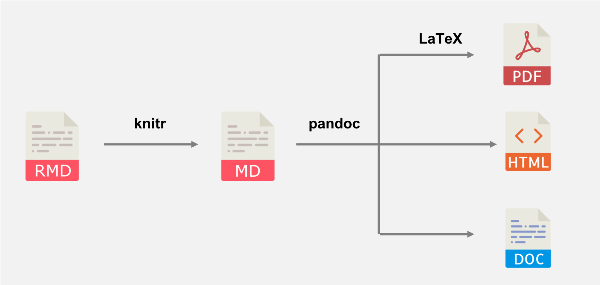

```{r setup, include=FALSE}
# DO NOT ALTER CODE IN THIS CHUNK
# Set knitr options
knitr::opts_chunk$set(
  echo = TRUE, eval = TRUE, fig.width = 5,
  fig.asp = 0.618, out.width = "80%", dpi = 120,
  fig.position = "!h", cache = FALSE
)
# Load packages
suppressPackageStartupMessages(library(tidyverse))
# SangwonYum
if (.Platform$OS.type == "unix") {
  git_remote <- system('git config --get remote.origin.url', intern = TRUE)
  git_user <- str_extract(git_remote, "lab-1-.+") %>% str_sub(start = 7)
} else {
  git_remote <- shell('git config --get remote.origin.url', intern = TRUE)
  git_user <- str_extract(git_remote, "lab-1-.+") %>% str_sub(start = 7)
}
```

---
subtitle: "GitHub username: `r git_user`"
---

---

## Exercise 2

| Column 1 | Column 2 | Column 3 | Column 4 |
| --- | ---: | :---: | :--- |
| Notice | what | the | colons |
| are | doing? | | |

Table: The table with poor spacing

| Column 1 | Column 2 | Column 3 | Column 4 |
| -------- | -------: | :------: | :------- |
| Notice   | what     | the      | colons   |
| are      | doing?   |          |          |

Table: The table with good spacing

Question 1: Do both tables look the same after being rendered?

Answer: Yes, both tables look the same when the document is rendered. even though the spacing between the columns is different in the code, the final tables appear identical in the output. markdown ignores the extra spacing when it renders the table.

Question 2: What are the snippets below each table doing?

Answer: The snippets below each table define the alignment of the columns. the dashes (---) create the structure of the table, while the colons (:) control how the text is aligned. 

--- means the column is left aligned by default 

---: means the text is right aligned 

:---: means the text is centered 

:--- means left aligned with an explicit marker. 

So these symbols tell markdown how each column should be formatted in the final table.

## Exercise 3


Question: What does the text inside the square brackets do?

Answer: The text inside the square brackets is the image caption or alternative text. It describes the image and will appear if the image cannot be displayed. It also helps readers understand what the image represents.

## Exercise 4

Lorem ipsum dolor sit amet, consectetur adipiscing elit, sed do eiusmod tempor incididunt ut labore et dolore magna aliqua.

    Lorem ipsum dolor sit amet, consectetur adipiscing elit, sed do eiusmod tempor incididunt ut labore et dolore magna aliqua.
    
Question 1: What effect do the four spaces before the second paragraph have?

Answer: The four spaces before the second paragraph turn the text into a code block. instead of being rendered as normal text, it is displayed in a fixed-width font and formatted like code.

Question 2: Why might this make the text harder to read?

Answer: When text is displayed as a code block, standard paragraph formatting disappears. due to differences in font and spacing, long text like the example above is cut off at the end, making it difficult to read at a glance. code blocks are more suitable for displaying code than for regular text.


## Exercise 5

The Pythagorean theorem can be written as $c = \sqrt{a^2 + b^2}$.

According to Newton's second law, acceleration can be written as $a = \frac{F}{m}$.


## Exercise 6

```{r, warning = FALSE}
qplot(x = sleep_total, y = sleep_rem, data = msleep)
```

Question: What does 'warning = FALSE' do?

Answer: The final output does not display warning messages when the option `warning = FALSE` is used. When the document is rendered, any warnings are hidden, but the code continues to function normally.
